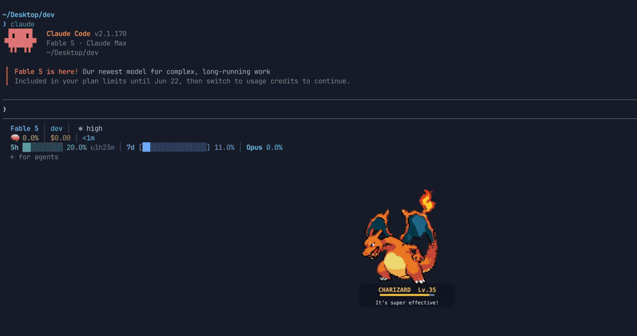

# claude-pokemon-pet

A Pokémon (or Digimon!) companion for Claude Code. A random partner appears,
reacts to what Claude is doing, levels up with every completed task, and
evolves along its real evolution chain. On macOS it floats over your screen
as a native overlay; on Linux, over SSH, or on a headless RunPod it lives
inside your terminal (`claude-pokemon-pet term`) or your statusline.

<p align="center">
  
</p>

## Features

- **Reacts to your session** — roams around while Claude works
  (`CHARIZARD used FLAMETHROWER!`), bobs while thinking, hops when a task
  completes (`It's super effective!`), fidgets when Claude needs your input,
  and falls asleep when you're idle.
- **Levels & evolves** — its level is the number of tasks Claude completed
  today (resets at midnight). It evolves at Lv.6 and Lv.16 with an EXP bar
  and a proper cinematic: sprite flash, `What? CHARMANDER is evolving!`,
  then `Congratulations! Your CHARMANDER evolved into CHARMELEON!`
- **Shinies & the dex** — the daily gacha rolls shiny 1/64 (✨ sparkle,
  real shiny sprites). Every partner you've ever had is recorded:
  `claude-pokemon-pet dex` shows `caught 23/151 · 1 shiny ✨`.
- **Battle FX & session health** — type-colored particle bursts while
  Claude works, an impact shake on task completion, and an HP bar that
  dips with failing tool calls and refills as tasks complete.
- **Daily gacha** — one of 81 gen-1 evolution chains is rolled the first time
  the overlay starts each day (Magikarp days build character). Your partner
  never changes mid-run; reroll anytime with the `pet random` command.
- **A system-wide companion** — the pet floats above *everything* on your
  Mac (every app, window, and Space), not just the terminal. It is
  click-through, so it never steals clicks or focus. Hold ⌥ (Option) and
  drag to put it wherever you like.
- **English & Korean** — names and battle text follow your system language,
  with official Korean names for all 151 Pokémon (`피카츄의 10만볼트!`).

## Requirements

Everyone needs Claude Code with plugin support and
[`jq`](https://jqlang.github.io/jq/) (the game core is bash + jq).
Per mode:

| Mode | Needs | Notes |
|---|---|---|
| Floating overlay | macOS + [`gifsicle`](https://www.lcdf.org/gifsicle/) | native AppKit window (JXA); `curl`/`osascript` ship with macOS |
| Terminal pet (`term`) | any OS + `python3` (≥3.8, stdlib only) + `curl` | works on Linux, over SSH, in devcontainers and RunPods |
| Statusline | just `jq` | one line in any terminal |

macOS: `brew install jq gifsicle` · Debian/Ubuntu: `apt install jq` (python3
and curl are usually present)

## Install

1. Install the dependencies above.
2. In Claude Code:

   ```
   /plugin marketplace add junoh-bg/claude-pokemon-pet
   /plugin install claude-pokemon-pet@claude-pokemon-pet
   ```

3. Run `/reload-plugins` to activate it in the current session (or just
   start a new session).

On first activation, sprites for all 151 gen-1 Pokémon are downloaded
(~5 MB, one time, a few seconds) and your first partner appears in the
bottom-right corner of the screen your mouse is on.

## Usage

### Slash command

The command is namespaced by plugin name: `/claude-pokemon-pet:pet`. Type
`/pet` and pick it from the autocomplete menu to get there.

```
/claude-pokemon-pet:pet            toggle the overlay
/claude-pokemon-pet:pet random     roll a new random partner
/claude-pokemon-pet:pet pikachu    switch to a specific pokémon (eevee picks a random branch)
/claude-pokemon-pet:pet lang ko    switch language (ko | en | auto)
/claude-pokemon-pet:pet status     show partner, state, and today's task count
```

### Terminal mode (Linux / SSH / RunPod)

No display? The pet renders *inside* a terminal — including over SSH to a
headless box, because the graphics stream as ordinary terminal output:

```sh
claude-pokemon-pet term
```

Run it in a tmux split or a second SSH session **on the same machine where
Claude Code runs** (the hooks and cache live there). Graphics are picked
automatically:

| Tier | Terminals | Look |
|---|---|---|
| Kitty graphics protocol | kitty, WezTerm, Ghostty | pixel-perfect animated sprite |
| iTerm2 inline images | iTerm2 | native animated GIF |
| ANSI half-blocks | anything 256-color (incl. inside tmux) | chunky pixel art |

Force a tier with `PET_TERM_MODE=kitty|iterm|ansi` (inside tmux the default
is half-blocks; graphics protocols need tmux `allow-passthrough`). Ctrl-C
quits and restores your terminal.

### Digimon mode

```
claude-pokemon-pet digimon      # or: /claude-pokemon-pet:pet digimon
```

Your partner becomes one of the five original 1997 **Digital Monster V-pet**
lines (Ver.1–Ver.5), drawn with the authentic LCD sprites. Five stages, gated
by tasks completed today: Baby → In-Training (2) → Rookie (5) → Champion (10)
→ Ultimate (18) — then the gold EXP bar takes over.

Unlike Pokémon mode, evolution **branches** — and it watches how your session
is going. Each failing tool call counts as a *care mistake* (user interrupts
don't count; `pet status` shows today's tally). If you have **3+ care
mistakes at the moment an evolution triggers**, your partner takes the
canonical joke path (Numemon and friends await the sloppy). Each evolution
choice is locked in for the day, exactly like the real V-pet.

`claude-pokemon-pet pokemon` switches back; `pet agumon` (or `pet 파피몬`)
jumps straight to a specific line — you start from its egg, V-pet style.

### Statusline pet

A one-line pet for Claude Code's statusline — works absolutely everywhere:

```
🔥 CHARMELEON Lv.12 ▰▰▰▱▱ ⚔️
```

Run `claude-pokemon-pet statusline` to print the one-line `settings.json`
snippet (we never edit your settings for you) and a live preview.

### CLI

The same commands are available from your shell via the bundled CLI:

```sh
~/.claude/plugins/marketplaces/claude-pokemon-pet/scripts/claude-pokemon-pet \
    [toggle|on|off|random|pet <name>|lang <ko|en|auto>|sprites|status]
```

Optionally symlink it onto your PATH and bind a tmux key:

```sh
ln -s ~/.claude/plugins/marketplaces/claude-pokemon-pet/scripts/claude-pokemon-pet /opt/homebrew/bin/claude-pokemon-pet
```

```tmux
# ~/.tmux.conf
bind P run-shell "/opt/homebrew/bin/claude-pokemon-pet toggle"
```

`claude-pokemon-pet off` also disables the session autostart until you run
`claude-pokemon-pet on` (or toggle via the slash command) again.

### Positioning

The overlay is **system-wide**: it stays on top of every app and Space on
your Mac, not only the terminal — your partner keeps you company in the
browser, editor, Slack, everywhere. Because it is click-through, it never
interferes with whatever is underneath.

To move it: **hold ⌥ (Option), then click-drag the pet** — anywhere on any
display. Release to drop; the new spot becomes its home (saved across
restarts). It spawns bottom-right of the screen your mouse is on the first
time it starts.

To get it out of the way entirely, toggle it off (`prefix+P` /
`claude-pokemon-pet off` / the slash command).

### Moods

| Session event | Pet behavior | Caption |
|---|---|---|
| You submit a prompt | slow bob | `PIKACHU is getting pumped!` |
| Claude uses tools | roams left/right, faces its walking direction | `PIKACHU used THUNDERBOLT!` |
| Task completes | excited hops (+1 Lv) | `It's super effective!` |
| Permission needed | anxious fidget | `PIKACHU looks at you expectantly` |
| New session | greeting hops | `Go! PIKACHU!` |
| Idle | breathing, dimmed | `PIKACHU is fast asleep` |

### Language

Names and captions follow your macOS system language — Korean systems get
the official Korean names and battle text (`피카츄의 10만볼트!`,
`효과는 굉장했다!`). Override anytime:

```sh
claude-pokemon-pet lang ko     # force Korean
claude-pokemon-pet lang en     # force English
claude-pokemon-pet lang auto   # follow the system again
```

Korean names also work when picking a partner: `pet 파이리`. (The English
captions shown elsewhere in this README appear in Korean when `lang` is `ko`.)

## Configuration

| Tunable | Where | Default | Meaning |
|---|---|---|---|
| `gates` | `data/pokemon/pack.json` | `[0, 6, 16]` | tasks per day to reach each stage |
| `BOTTOM_OFFSET` | `scripts/pet-overlay.js` | 30 | default distance from the bottom screen edge (px) |
| `ROAM` | `scripts/pet-overlay.js` | 240 | how far it wanders while working (px) |

## Updating

```
/plugin marketplace update claude-pokemon-pet
/reload-plugins
```

`marketplace update` pulls the latest release and bumps the installed
version; `reload-plugins` applies it to the current session.

## Troubleshooting

The CLI lives at
`~/.claude/plugins/marketplaces/claude-pokemon-pet/scripts/claude-pokemon-pet`
(referred to below as `claude-pokemon-pet`).

- **No pet after install** — run `claude-pokemon-pet status`. Most common
  cause: missing `jq`/`gifsicle` (the CLI prints which).
- **Pet on the wrong screen** — it spawns on the screen your mouse is on at
  start. Toggle it off and on with the mouse on the right screen, or ⌥-drag
  it anywhere, including across displays.
- **Reset position** — `rm ~/.cache/claude-pokemon-pet/pos`, then restart the pet.
- **Re-download sprites** — `claude-pokemon-pet sprites`.
- **Full reset** (level, partner, position, sprites) —
  `rm -r ~/.cache/claude-pokemon-pet`, then start a new session.

## Uninstall

```
/plugin uninstall claude-pokemon-pet
```

then remove the runtime cache and the optional symlink:

```sh
rm -r ~/.cache/claude-pokemon-pet
rm -f /opt/homebrew/bin/claude-pokemon-pet
```

## How it works

| Piece | Role |
|---|---|
| `hooks/hooks.json` | registers Claude Code hooks automatically on install |
| `scripts/pet-core.sh` | the game core: reduces hook events to `resolved.json` — the single file every renderer reads (species, level, EXP, localized names/moves) |
| `scripts/pet-overlay.js` | JXA/AppKit overlay, a pure view of `resolved.json`: native GIF playback, 20 fps motion engine, battle-log captions, ⌥-drag |
| `scripts/claude-pokemon-pet` | CLI: overlay process management; delegates game ops to the core |
| `scripts/pet-term.py` + `scripts/petgif.py` | terminal renderer (pure-stdlib Python): GIF decode, kitty/iTerm2/ANSI backends |
| `scripts/pet-statusline.sh` | one-line statusline renderer |
| `scripts/get-sprites.sh` | downloads sprites, builds nearest-neighbor upscales + mirrored variants |
| `data/pokemon/pack.json` | franchise pack: 81 evolution lines, 151 species with English/Korean names, move pools, sprite source |
| `data/digimon/pack.json` | franchise pack: the five 1997 V-pet versions — 70 species, branching evolution graph with care-mistake reject paths |

Hook events: `UserPromptSubmit` → thinking, `PostToolUse` → working,
`PostToolUseFailure` → a "care mistake" (daily counter, drives upcoming
features), `Stop` → done (+1 task), `PermissionRequest` → waiting,
`SessionStart` → hello + overlay autostart. All state lives in
`~/.cache/claude-pokemon-pet/` (including your `dex.json` — every partner
you've ever had — and daily streak); the plugin directory itself is never
written to.

## Privacy & security

This plugin runs entirely on your machine. It downloads Pokémon sprites from
[PokeAPI](https://github.com/PokeAPI/sprites) once on first run and makes no
other network calls. It collects no data and sends nothing anywhere. All it
writes is session state and your sprite cache under `~/.cache/claude-pokemon-pet/`.
The overlay is a local `osascript` window; the hooks are small shell scripts
you can read in `scripts/`.

## Credits

Sprites are fetched at install time and are not redistributed with this
repo: Pokémon from [PokeAPI/sprites](https://github.com/PokeAPI/sprites)
(gen-5 Black/White animated set), Digimon V-pet sprites from
[Wikimon](https://wikimon.net). Pokémon is © Nintendo / Creatures Inc. /
GAME FREAK inc.; Digimon is © Bandai. This is a fan-made tool, not
affiliated with or endorsed by them.

MIT licensed — see [LICENSE](LICENSE).
